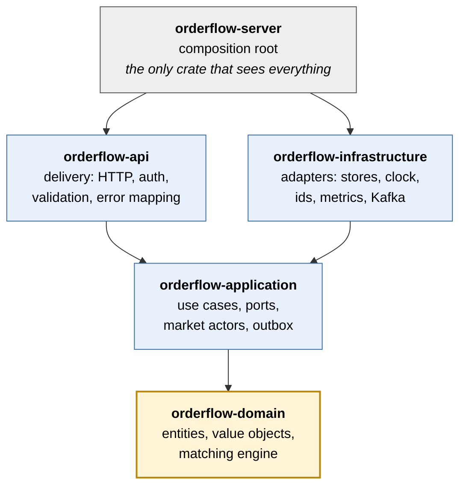

# ADR 0001: Clean architecture instead of a layered architecture

- Status: accepted
- Date: 2026-09-25

## Context

Orderflow is exchange core infrastructure: a matching engine with an API in
front of it and an event stream behind it. Two structures were considered.

Layered (n-tier). Presentation calls business logic, business logic calls
data access, and data access calls the database. Dependencies point down,
towards persistence. The model is simple and familiar, and it suits CRUD
services well.

Clean architecture (ports and adapters). The domain sits in the center and
depends on nothing. The use cases around it declare the interfaces (ports)
they need. Delivery (HTTP) and infrastructure (Kafka, storage, clocks) are
adapters on the outside. Dependencies point in, towards the domain.

The forces that matter for this system:

1. The matching rules are the most valuable part and have to outlive every
   transport and broker choice. The API is REST today and events go to
   Kafka; later there may be gRPC, FIX or a different log.
2. Correctness has to be cheap to check. Matching needs thousands of
   randomized test cases per run, which is only practical if the rules run
   as plain function calls without a database, broker or runtime.
3. Exchanges rebuild state by replaying a journal. That requires a core
   that never reads a clock or generates ids on its own.
4. Several adapters per port. Events go to the log, to Kafka or to both;
   storage is in memory for tests and a database in production.
5. Many engineers work on the code, so boundaries should be enforced by the
   build as well as by review.

## Decision

Use clean architecture, with one Cargo crate per ring. Arrows point from a
crate to the crates it depends on:

Cargo enforces the dependency rule. `orderflow-domain` lists only
`rust_decimal`, `thiserror` and `uuid` as dependencies, so importing tokio,
axum or rdkafka there is a compile error.

## Comparison with a layered design

In a layered design the business layer depends on the data access layer.
Here that would make the matching engine depend on how orders are stored
and published.

| Concern | Layered | Clean (chosen) |
|---|---|---|
| Dependency direction | Business -> data access | Adapters -> use cases -> domain |
| Testing the matching rules | Needs mocks or a real database | Plain calls; property tests run in milliseconds |
| Swapping Kafka or storage | Touches the business layer | New adapter plus one line in the composition root |
| Replay from a journal | Hard, because time and ids come from infrastructure | Time and ids are inputs to the engine |
| Enforcement | Convention | Compiler, through crate boundaries |
| Reuse | The engine brings its data layer along | Other services (risk, simulation) can depend on the domain crate alone |

## Consequences

Benefits:

- The domain crate is a small, reusable library with no async and no IO.
- Each ring can be tested on its own: the domain with property tests, the
  application with hand written fakes, the API with the real router and
  in-memory adapters.
- Adding an adapter such as Postgres or gRPC does not change existing code,
  which applies the open/closed principle at the architecture level.

Costs:

- More types. HTTP DTOs, the Kafka wire schema and the domain model are
  mapped by hand. This keeps a domain rename from changing a public
  contract, at the price of more code than a layered service would need.
- Trait objects (`Arc<dyn Port>`) add a virtual call at each port. The
  matching engine itself is a concrete type, so the hot path does not pay
  for it.
- Five crates instead of one. The workspace keeps this manageable.

For a CRUD service without domain logic of its own, a layered architecture
would be the simpler and cheaper choice. Orderflow's value is its domain
logic, so the extra structure pays for itself.
